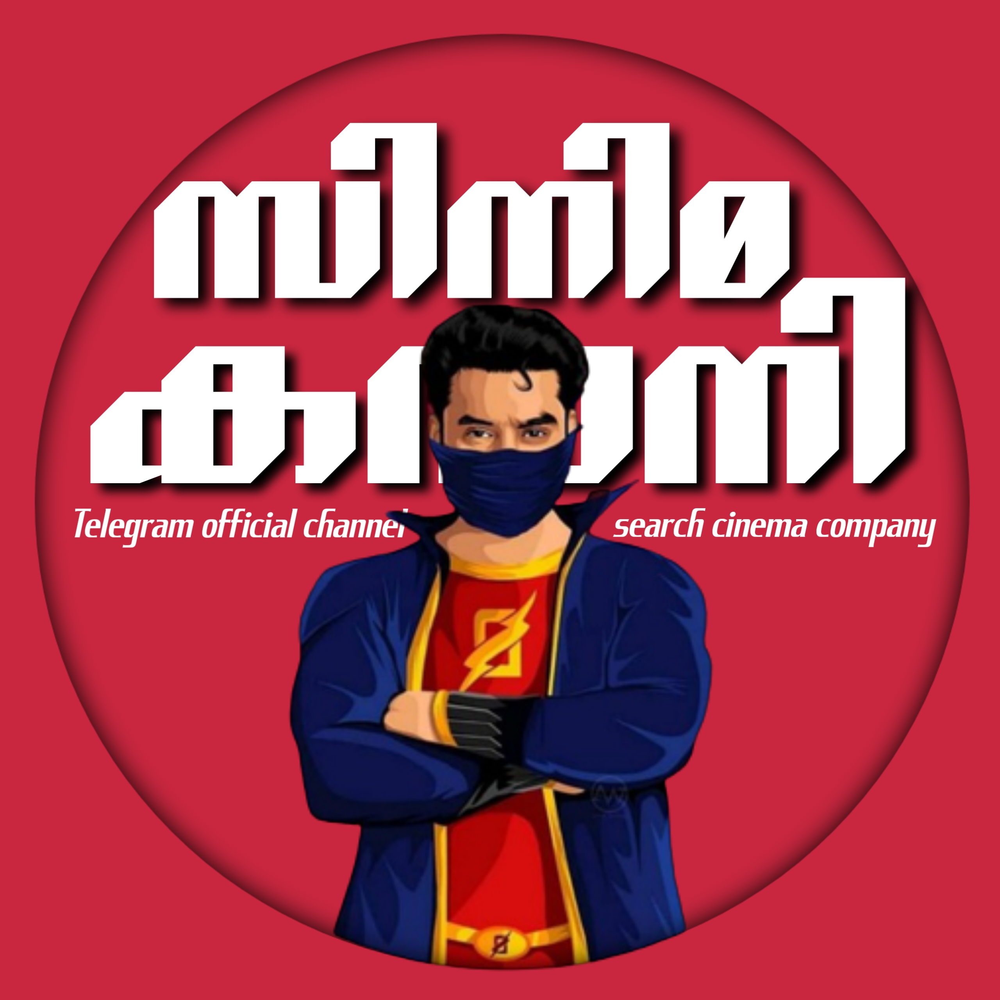

<p align="center">
  
</p>
<h1 align="center">
  <b>ᴛᴇᴀᴍ ᴛᴏᴠɪɴᴏ ʙᴏᴛ</b>
</h1>


[](https://github.com/EvamariaTG/EvaMaria/stargazers)
[](https://github.com/EvamariaTG/EvaMaria/fork)
[](https://github.com/EvamariaTG/EvaMaria/)   
[](https://github.com/EvamariaTG/EvaMaria)   
[](https://github.com/EvamariaTG/EvaMaria/graphs/contributors)
[](https://github.com/EvamariaTG/EvaMaria/blob/main/LICENSE)
[](https://stars.medv.io/EvamariaTG/EvaMaria)


## Features

- [x] ᴀᴜᴛᴏ ғɪʟᴛᴇʀ
- [x] ᴍᴀɴᴜᴀʟ ғɪʟᴛᴇʀ
- [x] ɪᴍᴅʙ
- [x] ʟᴏᴀᴅɪɴɢ ᴀɴɪᴍᴀᴛɪᴏɴ
- [x] ᴀᴅᴍɪɴ ᴄᴏᴍᴍᴀɴᴅs
- [x] ʙʀᴏᴀᴅᴄᴀsᴛ
- [x] ɪɴᴅᴇx
- [x] ɪᴍᴅʙ sᴇᴀʀᴄʜ
- [x] ɪɴʟɪɴᴇ sᴇᴀʀᴄʜ
- [x] ʀᴀɴᴅᴏᴍ ᴘɪᴄs
- [x] ɪᴅs ᴀɴᴅ ᴜsᴇʀ ɪɴғᴏ 
- [x] sᴛᴀᴛs, ᴜsᴇʀs, ᴄʜᴀᴛs, ʙᴀɴ, ᴜɴʙᴀɴ, ʟᴇᴀᴠᴇ, ᴅɪsᴀʙʟᴇ, ᴄʜᴀɴɴᴇʟ
- [x] sᴘᴇʟʟɪɴɢ ᴄʜᴇᴄᴋ ғᴇᴀᴛᴜʀᴇ 
- [x] ғɪʟᴇ sᴛᴏʀᴇ


```
## Support
[](https://telegram.dog/EvaMariaSupport)
[](https://telegram.dog/TeamEvamaria)

## Credits 
* [](https://telegram.dog/EvaMariaDevs)


## Thanks to 
 - Thanks To Dan For His Awesome [Library](https://github.com/pyrogram/pyrogram)
 - Thanks To Mahesh For His Awesome [Media-Search-bot](https://github.com/Mahesh0253/Media-Search-bot)
 - Thanks To [Trojanz](https://github.com/trojanzhex) for Their Awesome [Unlimited Filter Bot](https://github.com/TroJanzHEX/Unlimited-Filter-Bot) And [AutoFilterBoT](https://github.com/trojanzhex/auto-filter-bot)
 - Thanks To All Everyone In This Journey

### Note

[Note To A So Called Dev](https://telegram.dog/subin_works/203): 

Kanging this codes and and editing a few lines and releasing a V.x  or an [alpha](https://telegram.dog/subin_works/204), beta , gama branches of your repo won't make you a Developer.
Fork the repo and edit as per your needs.

## Disclaimer
[](https://www.gnu.org/licenses/agpl-3.0.en.html#header)    
Licensed under [GNU AGPL 2.0.](https://github.com/EvamariaTG/evamaria/blob/master/LICENSE)
Selling The Codes To Other People For Money Is *Strictly Prohibited*.

## Inspiration
This is an attempt to create a clone of a BOAT made out of [banana trees 🌳](https://telegram.dog/GetTGLink/4187)

[](https://telegra.ph/file/98342dc186fd7484cba91.mp4 "Oru Kootam Vazhakalk samarpikkunnu")
